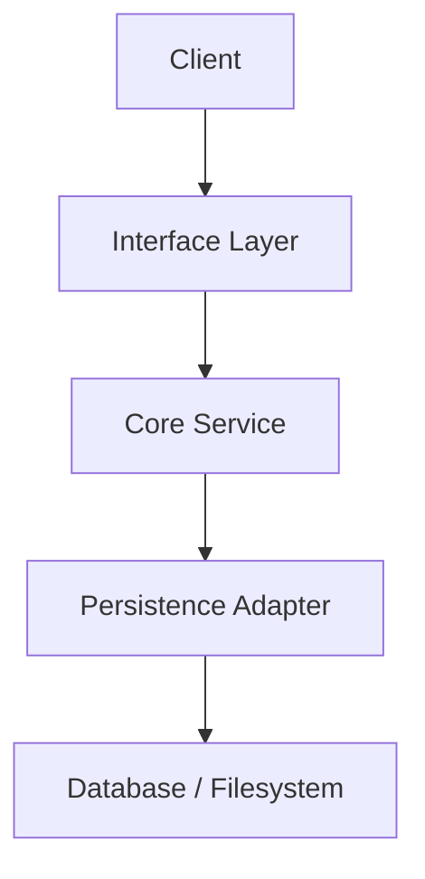
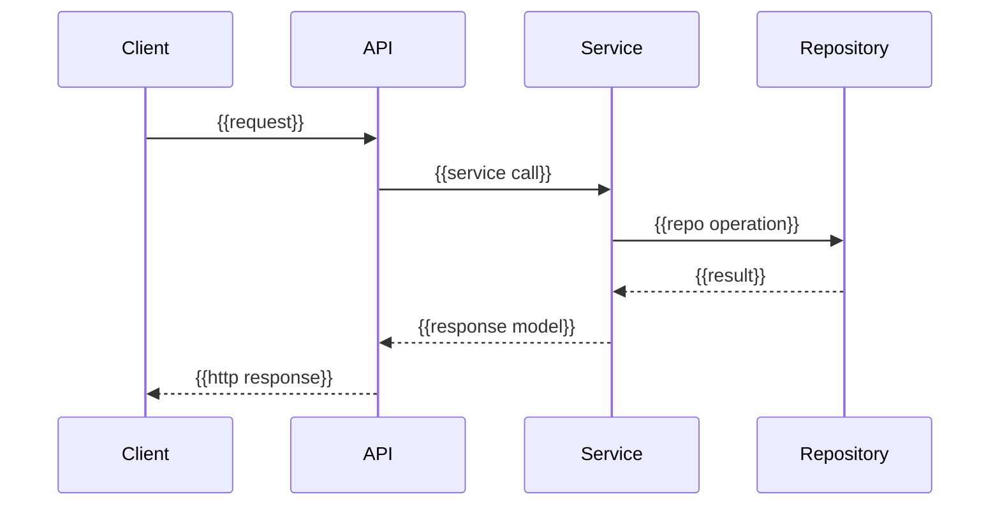

# Milestone {{NN}} Changelog - {{Title}}

This changelog documents implementation of [{{plan-or-spec}}]({{absolute-plan-path}}).

## Scope Delivered

- {{Delivered behavior 1 with links}}.
- {{Delivered behavior 2 with links}}.
- {{Delivered behavior 3 with links}}.

## Architecture Snapshot

Why this shape:
- {{Reason 1 with links}}.
- {{Reason 2 with links}}.

## Runtime Flow

## Design Notes

- {{Decision 1 and rationale with links}}.
- {{Decision 2 and rationale with links}}.
- {{Known limitation/tradeoff}}.

## Schema Reference

Source: [{{migration or model source}}]({{absolute-schema-source-path}}).

### `{{table_name}}`

| Field | Type | Nullable | Default / Constraint | Role |
| --- | --- | --- | --- | --- |
| `{{field}}` | `{{type}}` | {{Yes/No}} | {{constraint}} | {{clear explanation of why this field exists}} |
| `{{field}}` | `{{type}}` | {{Yes/No}} | {{constraint}} | {{clear explanation of why this field exists}} |

## Verification Notes

- {{Unit/integration test coverage with links}}.
- {{Any environment dependencies or skips}}.
