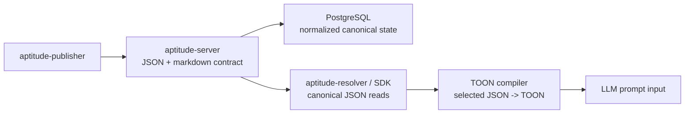

# JSON to TOON Migration Draft

> Status: draft/context document, not the canonical live contract.
> Use [docs/README.md](../README.md), [docs/project/api-contract.md](../project/api-contract.md),
> [docs/project/scope.md](../project/scope.md), and [docs/prd.md](../prd.md)
> for the current `aptitude-server` baseline.

This draft evaluates whether Aptitude should migrate from JSON to TOON.

The short answer is: **not wholesale**.

TOON is a strong fit for structured data that will be read by LLMs, especially
uniform arrays. It is a weak fit for Aptitude's current frozen public HTTP
contract, and it is an especially poor fit for raw multiline markdown content.
The right move is to introduce TOON only as a client-side compilation format for
LLM input, derived from canonical JSON right before prompt assembly, while
keeping JSON as the canonical server API and PostgreSQL/domain models as the
canonical internal representation.

This draft assumes the real goal is:

- reducing token and readability overhead when Aptitude data is sent to LLMs

If the goal is "replace all machine-facing JSON with TOON everywhere," this
draft explicitly recommends against that direction.

## 1. Executive Summary

- **Problem**: Aptitude currently uses JSON for publish, discovery, fetch, and
  resolution payloads. JSON is the right default for FastAPI, OpenAPI, machine
  clients, and persistence-facing tooling, but it is verbose for LLM-facing
  workflows.
- **TOON Fit**: TOON is a compact, line-oriented encoding of the JSON data
  model. It is strongest for uniform arrays of primitive-only objects and for
  prompt/export scenarios where token efficiency and structural readability
  matter.
- **Critical Constraint**: Aptitude stores and serves raw markdown skill bodies.
  TOON does not provide markdown block scalars; multiline strings are encoded as
  quoted strings with escaped newlines. That removes most of TOON's readability
  advantage for `content.raw_markdown`.
- **Recommendation**: keep JSON as the canonical HTTP contract, keep markdown as
  `text/markdown`, keep PostgreSQL/domain objects JSON-native, and introduce
  TOON only as a client-side JSON -> TOON compilation step for LLM input.

## 2. Current State and Architectural Fit

Today the server contract is intentionally registry-first and JSON-first:

- `POST /skills/{slug}` accepts a normalized JSON publish body.
- `GET /skills/{slug}` and `GET /skills/{slug}/{version}` return JSON.
- `GET /resolution/{slug}/{version}` returns JSON.
- `GET /skills/{slug}/{version}/content` returns `text/markdown`.

The current publish shape also mixes two very different content classes:

- structured metadata and relationships
- raw multiline markdown content

That matters because TOON's strengths and weaknesses are uneven across those two
classes.

### Fit by Surface

| Surface | Current Shape | TOON Fit | Why |
| --- | --- | --- | --- |
| `POST /skills/{slug}` publish body | nested object + raw markdown + schemas | Low | The markdown body would become a large escaped string; nested schemas reduce tabular benefit. |
| `POST /discovery` | very small JSON object | Low | Payloads are small; migration cost is larger than token savings. |
| `GET /skills/{slug}` | object containing uniform `versions[]` list | Medium | The `versions` list is structurally friendly to TOON tabular encoding. |
| `GET /resolution/{slug}/{version}` | object with `depends_on[]` | Medium | Works when dependency rows are simple, but nested `markers[]` reduce tabular eligibility. |
| `GET /skills/{slug}/{version}` | nested metadata object | Low to Medium | Some metadata is simple, but `headers`, `inputs_schema`, and `outputs_schema` are nested objects. |
| `GET /skills/{slug}/{version}/content` | raw markdown | No | Markdown is already the right representation. TOON would make it worse. |

Architectural conclusion:

- TOON is **not** a good replacement for the frozen registry API as a whole.
- TOON is **not** a good persistence format for PostgreSQL-backed domain state.
- TOON **is** a good candidate for client-side LLM input compilation from
  selected structured JSON fields, especially metadata-centric views.

## 3. Goals

- Reduce token overhead for Aptitude data embedded into LLM prompts.
- Improve readability of structured prompt input without changing storage or API contracts.
- Preserve the current server boundary: JSON API + markdown content + normalized persistence.
- Keep round-trippable, deterministic mapping between JSON domain objects and TOON documents.
- Avoid breaking existing publisher, resolver, or API clients.

## 4. Non-Goals

- Replacing all JSON responses with `text/toon`.
- Replacing `GET /skills/{slug}/{version}/content` with TOON.
- Making PostgreSQL store raw TOON as the canonical source of truth.
- Using TOON as a database-facing serialization format.
- Hand-writing a custom TOON parser inside the server.
- Changing server-owned product boundaries to chase prompt-format fashion.

## 5. Migration Options

### Option A: Big-bang JSON-to-TOON API replacement

Replace current JSON request/response bodies with `text/toon` across publish,
discovery, fetch, and resolution.

**Pros**

- One representation everywhere.
- Strong ideological consistency.

**Cons**

- Wrong fit for FastAPI/OpenAPI tooling.
- Breaks or complicates existing machine clients for limited benefit.
- Conflicts with TOON's own positioning as a translation layer, not a public API replacement.
- Makes markdown-heavy publish bodies materially worse to author and inspect.
- Forces dual maintenance anyway because JSON remains the internal/Pydantic shape.

**Recommendation**: reject.

### Option B: Additive TOON support at selected server read endpoints

Keep JSON canonical, but optionally expose `text/toon` for a small subset of
exact read routes.

**Pros**

- Incremental and reversible.
- No break to existing JSON clients.
- Allows benchmarking on real Aptitude payloads.

**Cons**

- Dual-format parity burden.
- Some payloads are poor TOON candidates, so the benefit is uneven.
- Server still owns format negotiation and documentation complexity.

**Recommendation**: reasonable later, but not the first move.

### Option C: Client-side JSON -> TOON compilation for LLM input only

Use TOON where it fits best:

- resolver-side conversion of JSON into TOON before sending data to LLMs
- optional publisher-side or tool-side prompt generation from canonical JSON
- no TOON in persistence, API contracts, or internal domain storage

Keep the server's canonical API unchanged unless later benchmarks prove a clear
benefit for specific export helpers.

**Pros**

- Preserves the public contract.
- Aligns with TOON's stated strengths.
- Keeps TOON out of the DB and out of the server core.
- Avoids TOON-wrapping markdown.
- Delivers value where token efficiency actually matters.

**Cons**

- Does not produce a "TOON-native server" story.
- Requires explicit client-side prompt-assembly tooling.

**Recommendation**: recommended now.

## 6. Recommended Target Architecture

The clean architecture move is to keep TOON at the prompt edge only, not in the
API, persistence, or domain core.



Key rules:

- The server keeps JSON request/response DTOs as the canonical API contract.
- The server keeps markdown content as markdown.
- PostgreSQL stores normalized domain state, not TOON documents.
- TOON is generated from canonical JSON only at the client edge before LLM use.
- Any future `text/toon` server response is an **alternate export**, not a new
  source of truth.

## 7. Recommended Data Flow

Do **not** try to squeeze the publish payload or persisted records into TOON.
That is the wrong abstraction.

Recommended flow:

- server returns canonical JSON and markdown
- client selects the subset that is actually useful for prompting
- client compiles that subset into TOON
- client sends TOON to the LLM as prompt context

Recommended first-scope prompt input:

```json
{
  "slug": "python.lint",
  "version": "1.2.3",
  "metadata": {
    "name": "Python Lint",
    "description": "Lint Python files consistently",
    "tags": ["python", "lint"],
    "token_estimate": 180,
    "maturity_score": 0.92,
    "security_score": 0.88
  }
}
```

Compiled client-side into a TOON prompt view such as:

```toon
slug: python.lint
version: 1.2.3
metadata:
  name: Python Lint
  description: Lint Python files consistently
  tags[2]: python,lint
  token_estimate: 180
  maturity_score: 0.92
  security_score: 0.88
```

This preserves readability where TOON helps and keeps markdown in the format it
already belongs in.

## 8. Phased Migration Plan

### Phase 0: Reality Check and Benchmarking

Before changing any contract:

- inventory which Aptitude payloads are actually sent to LLMs
- benchmark JSON vs TOON on real Aptitude-shaped data, not generic TOON demo data
- measure:
  - token count
  - parse error rate
  - answer quality on retrieval/selection tasks
  - latency on target model providers

Exit criteria:

- measurable improvement on a real Aptitude workload
- no hidden regression from markdown escaping or nested-schema overhead

### Phase 1: Publisher/Resolver-side TOON adoption, zero server contract changes

Recommended first implementation:

- add JSON -> TOON compilation utilities in resolver/client-side tooling
- compile only the subset of JSON actually used in prompts
- keep `aptitude-server` unchanged

This gives the team the main prompt-efficiency benefit without
touching the frozen API.

### Phase 2: Optional server-side TOON for exact structured reads

Only if Phase 1 shows real value, add optional TOON support for:

- dedicated export/helper surfaces that emit prompt-oriented TOON derived from
  canonical JSON
- possibly metadata-centric exports derived from `GET /skills/{slug}` where the
  `versions[]` list benefits from tabular TOON

Do **not** start with:

- `POST /discovery`
- error envelopes
- `/content`
- full publish body ingestion

Reason: small JSON bodies and markdown bodies are the worst places to pay
format-negotiation complexity.

### Phase 3: Re-evaluate optional server exports

Only after the ecosystem proves stable:

- consider whether a server-owned TOON export helper reduces duplicated
  client-side prompt assembly logic
- keep JSON publish/read support as the canonical contract

This phase is optional. It is not required to get most of the value.

## 9. Implementation Guidelines

- Treat TOON as a codec layer, not a domain model.
- Treat TOON as an LLM-input view, not an API or DB format.
- Do not hand-roll parsing logic; use a maintained implementation plus golden test vectors.
- Keep one canonical semantic model and generate both JSON and TOON from it.
- Add golden fixtures for prompt views:
  - selected JSON -> TOON
  - same selected JSON -> stable TOON across releases unless intentionally changed
- Add parity tests on any helper that emits TOON from canonical JSON.
- Version the TOON codec behavior explicitly so future spec changes do not silently alter wire output.

## 10. Risks

### Markdown mismatch

This is the biggest architectural risk. Aptitude's skill body is markdown, and
TOON does not improve that content. A one-document TOON publish artifact would
push a markdown-native surface into an escaped-string representation.

### Not DB-compatible by design

TOON is not the right shape for PostgreSQL-backed domain persistence, indexing,
or query behavior. Converting canonical records into TOON before storage would
make the system harder to validate, query, migrate, and document.

### Poor fit for some nested structures

`headers`, `inputs_schema`, and `outputs_schema` are nested JSON-like objects.
TOON can represent them, but the benefit is smaller than it is for uniform
tables. This is why the strongest first win is prompt formatting, not storage
or contract migration.

### Tooling asymmetry

FastAPI, Pydantic, and OpenAPI are JSON-native. Any TOON server support becomes
custom codec and documentation work.

### Dual-format drift

If JSON and TOON are both supported, parity bugs become a real risk. The only
defense is shared canonical models plus strong golden tests.

### Misleading success metrics

TOON benchmark wins on generic datasets do not guarantee wins for Aptitude.
Many Aptitude payloads are small or nested, not large uniform tables.

## 11. Recommendation

Recommendation:

1. Do **not** migrate `aptitude-server` from JSON to TOON wholesale.
2. Do **not** replace markdown content with TOON.
3. Introduce TOON only as a client-side JSON -> TOON compilation step for LLM
   input.
4. Keep TOON out of the DB, out of canonical API contracts, and out of server
   persistence internals.
5. Add optional server-side TOON exports only if real workload benchmarking
   proves they reduce duplicated prompt assembly without harming the core model.

This path is simpler, truer to TOON's strengths, and materially safer for the
current Aptitude architecture.
